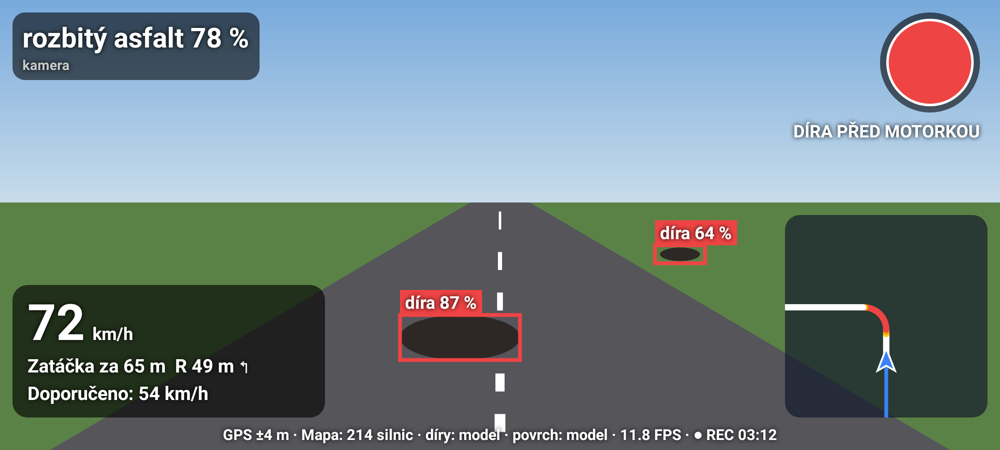

# MotorCam 🏍️

Ročníková práce: systém, který z kamery na řídítkách motorky rozpozná **povrch silnice**
(asfalt / rozbitý asfalt / štěrk / hlína-bláto / mokro), **detekuje díry a trhliny**,
podle **zatáček z OpenStreetMap** a rychlosti z GPS doporučí rychlost a rozsvítí
**varovnou kontrolku** (zelená / oranžová / červená) s pípáním.

> ⚠️ Prototyp vyhodnocovaný na nahraných jízdách, **ne bezpečnostní systém pro reálný provoz**.

Vše zdarma: Python, PyTorch, ultralytics, OpenStreetMap, trénink na Google Colab / Kaggle.



## Stav

| Fáze | Stav | Kde |
|---|---|---|
| 1. Data | ✅ | `src/dataset/`, `notebooks/01_data.ipynb`, `docs/datasety.md`, `docs/anotace.md` |
| 2. Model povrchu | ✅ kód hotový, trénink v Colabu | `src/models/surface.py`, `train_surface.py`, `notebooks/02_surface.ipynb` |
| 3. Model děr | ✅ kód hotový, trénink v Colabu | `src/models/detector.py`, `notebooks/03_detector.ipynb` |
| 4. Rozhodovací logika + zatáčky | ✅ | `src/fusion/` (+ stejné v aplikaci) |
| 5. Demo + TFLite | ✅ | `src/demo/`, `notebooks/05_demo_export.ipynb` |
| 6. Experimenty | ✅ kód hotový, čeká na data | `src/experiments/`, `notebooks/06_experiments.ipynb` |
| **Android aplikace** | ✅ APK 0.2 | `releases/MotorCam-0.2.apk`, `android/`, `docs/aplikace.md` |
| **Plánovač moto tras** | ✅ 7 tras Olomoucko + Jesenicko, vlastní trasy, zatáčkový režim | `android/assets/trasy.json`, `src/planner/` |

**Natrénované modely zatím nejsou** – trénink potřebuje GPU a stažené datasety (Colab).
Aplikace i bez nich umí zatáčky z mapy, pípání, povrch z vibrací, záznam jízdy, simulaci
a **plánovač motorkářských tras** s předpřipravenými trasami po Olomoucku a Jesenicku.

## Rychlý start

### Telefon
Nainstaluj `releases/MotorCam-0.2.apk` → viz [docs/aplikace.md](docs/aplikace.md).

### Počítač / Colab

```bash
git clone <url> motorcam && cd motorcam
pip install -r requirements.txt
python -m pytest            # testy (37)
```

Na Colabu otevři notebooky v pořadí `01 → 02 → 03 → 05 → 06` (každý si repozitář naklonuje sám,
data a výsledky ukládá na Google Drive).

## Postup práce

```
1. Data        python -m src.dataset.download rdd2022          # ~2,4 GB
               python -m src.dataset.rdd_to_yolo
               python -m src.dataset.download rscd --url "<odkaz>"
               python -m src.dataset.rscd_to_classes
   Vlastní     aplikace REC -> video + CSV  ->  python -m src.dataset.extract_frames data/custom/videos/
               anotace v Label Studiu       ->  python -m src.dataset.import_annotations labelstudio export.json
2. Povrch      python -m src.models.train_surface --data data/processed/rscd_cls --name surface_public
3. Díry        python -m src.models.detector train --sources data/processed/rdd2022_yolo --name det_public
   Doladění    ... --init <model z veřejných dat> --name *_finetuned  (viz notebooky)
5. Export      python -m src.demo.export_tflite surface|detector <váhy>   -> models/export/*.tflite -> telefon
   Demo        python -m src.demo.render video.mp4 --sensors video.csv --det ... --surface ...
6. Experimenty python -m src.experiments.compare | errors | speed_plot
```

## Struktura repozitáře

```
configs/config.yaml     všechna nastavení (třídy, prahy, parametry zatáček a kontrolky)
data/                   raw/ processed/ custom/ (necommitují se)
docs/                   PLAN, datasety a licence, anotace, aplikace, obrázky
notebooks/              Colab notebooky 01–06
src/dataset/            stažení, převody RDD2022/RSCD, snímky z videa, import anotací, statistiky
src/models/             model povrchu (+ augmentace), detektor YOLO, vyhodnocení
src/fusion/             OSM mapa, map matching, zatáčky, kontrolka, vibrace, načítání senzorů
src/demo/               demo video (overlay, minimapa, pípání), export TFLite + rychlost
src/experiments/        porovnání modelů, analýza chyb, graf rychlosti
src/planner/            analýza motorkářských tras (zatáčkovitost, grafy z GPX)
android/                aplikace (Java), vlastní build bez SDK, testy (JVM, Robolectric)
releases/               hotové APK
models/, results/       váhy a výstupy (grafy PNG+PDF, tabulky CSV) – necommitují se
tests/                  pytest
```

## Jak to funguje

```
kamera ─┬─ YOLO11n (díry, trhliny) ─────────────┐
        └─ MobileNetV3 (výřez silnice → povrch) ─┤
akcelerometr ── RMS vibrací (potvrzení povrchu) ─┼─► kontrolka (okno 1 s + hystereze 2 s) ─► barva + pípání
GPS ── rychlost, kurz ─┬────────────────────────┤
OSM silnice ── map matching ── trasa 300 m ── R ── v_max = √(g·R·tanθ), d = v·t + (v²−v_max²)/2a
```

Podrobně: [docs/PLAN.md](docs/PLAN.md).

## Datasety a licence

* **RDD2022** – Arya a kol., 2024, CC BY-SA 4.0 (figshare uvádí CC BY 4.0)
* **RSCD** – Zhao a kol., 2022, CC BY-NC
* **OpenStreetMap** – © přispěvatelé OpenStreetMap, ODbL (silnice, router OSRM, vyhledávání Nominatim)

Podrobnosti a citace: [docs/datasety.md](docs/datasety.md).
