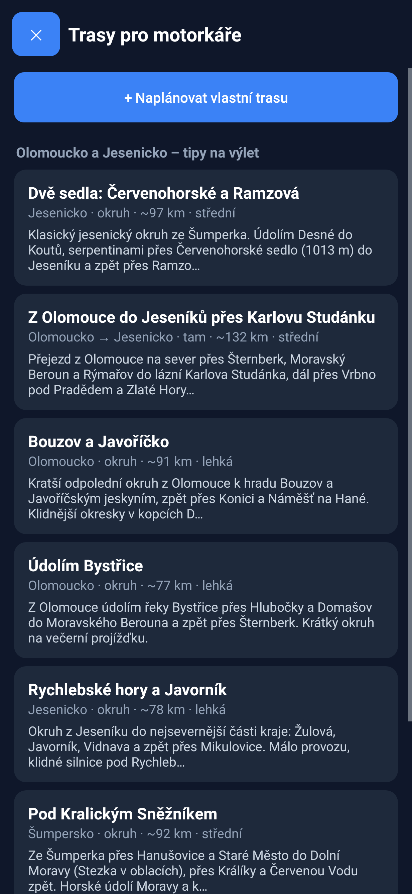
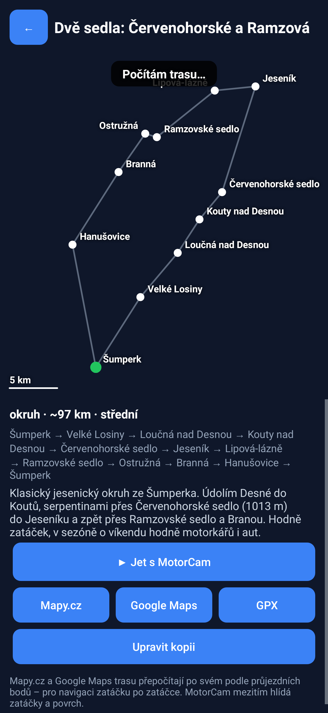
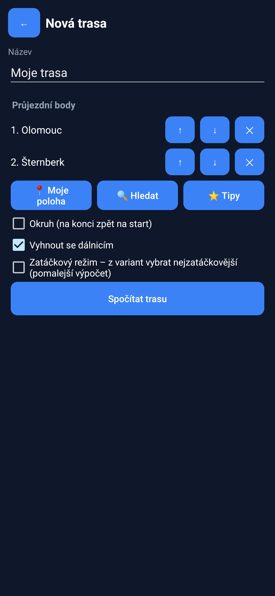

# Aplikace MotorCam pro Android


> Prototyp ročníkové práce – **není to bezpečnostní systém**. Vždy se řiď vlastním úsudkem.

## Instalace

1. Stáhni `releases/MotorCam-0.2.apk` do telefonu (Android 8.0 a novější).
2. Otevři ho a povol „Instalovat neznámé aplikace“ pro prohlížeč / správce souborů.
3. Play Protect může upozornit na neznámého vývojáře – zvol *Přesto nainstalovat*
   (aplikace je podepsaná ladicím klíčem, ne přes Google Play).
4. Při prvním spuštění povol **kameru** a **polohu**.

## Co funguje hned (bez natrénovaných modelů)

| Funkce | Jak |
|---|---|
| Varování před zatáčkami | silnice z OpenStreetMap (Overpass API) v okruhu 2 km, map matching, poloměr R, `v_max = √(g·R·tanθ)`, brzdná dráha; pípání + kontrolka |
| Povrch z vibrací | akcelerometr → RMS otřesů vs. kalibrace (☰ → Kalibrovat vibrace, 10 s jízdy po hladkém asfaltu) |
| Kontrolka | zelená / oranžová / červená s vyhlazením (klouzavé okno + hystereze) |
| Minimapa | okolní silnice, ujetá trasa, trasa 300 m dopředu obarvená podle nebezpečnosti zatáček |
| Záznam jízdy (REC) | video MP4 + CSV se senzory (GPS, akcelerometr, gyroskop, stav kontrolky) → *Stažené/MotorCam* – data pro trénink a demo |
| Simulace (SIM) | motorka jede po okolních silnicích zvolenou rychlostí – test zatáček a pípání doma |

Mapa se ukládá, takže v místě bez signálu funguje poslední stažená oblast.

## Trasy pro motorkáře (tlačítko TRASY)

| Plánovač | Detail trasy | Vlastní trasa |
|---|---|---|
|  |  |  |

- **7 předpřipravených tras na Olomoucku a Jesenicku**: Dvě sedla (Červenohorské + Ramzová),
  Z Olomouce do Jeseníků, Bouzov a Javoříčko, Údolím Bystřice, Rychlebské hory, Pod Kralickým
  Sněžníkem a Velký jesenický okruh (~250 km). Definice jsou v `android/assets/trasy.json`
  (průjezdní obce a sedla) – silnice mezi nimi při prvním otevření spočítá router **OSRM**
  (data OpenStreetMap, zdarma) a trasa se uloží do telefonu.
- **Vlastní trasa**: body z „Moje poloha“, vyhledávání (Nominatim/OSM) nebo z tipů v regionu;
  volby *okruh*, *vyhnout se dálnicím* a **zatáčkový režim** – pro každý úsek si vyžádá alternativy
  a vybere tu s nejvyšším skóre zatáčkovitosti.
- **Zatáčkovitost 0–100** a počet zatáček (vracečky < 25 m, ostré < 60 m, střední < 150 m,
  plynulé < 300 m) – stejný výpočet poloměrů jako varování před zatáčkami (`Curviness.java`).
- **▶ Jet s MotorCam**: varování před zatáčkami sleduje naplánovanou trasu (na křižovatkách už
  nehádá), minimapa ukazuje trasu fialově, panel „do cíle X km“. **SIM** pak jede přímo po trase.
- **Mapy.cz / Google Maps**: otevře navigaci s průjezdními body (hlasová navigace zatáčku po
  zatáčce), **GPX** uloží trasu do *Stažené/MotorCam* (import do Mapy.cz, Garmin, …).
- Rozbor tras do práce: `python -m src.planner.routes analyze *.gpx` (tabulka + grafy zatáček).

> Trasy nejsou projeté ani ověřené routerem při tvorbě (z vývojového prostředí nebyl router
> dostupný) – body jsou středy obcí a sedel, silnice dopočítá router v telefonu. Před jízdou
> zkontroluj uzavírky (např. sedla v zimě).

## Modely z kamery (díry, povrch)

1. Natrénuj modely v Colabu: `notebooks/02_surface.ipynb`, `notebooks/03_detector.ipynb`.
2. Exportuj: `notebooks/05_demo_export.ipynb` → `models/export/detector.tflite`, `surface.tflite`.
3. Soubory dostaň do telefonu (Google Drive, USB, e-mail).
4. V aplikaci ☰ → *Načíst model děr* / *Načíst model povrchu* a vyber soubor.
   Model se zkopíruje do aplikace a načte se i při dalším spuštění.

Formát modelů hlídá `src/demo/export_tflite.py check` (vstup `[1,H,W,3]` RGB 0–1,
povrch výstup `[1,5]`, detektor `[1,4+nc,N]`, názvy tříd v metadatech).

## Formát CSV z tlačítka REC

```
cas_s,typ,lat,lon,rychlost_kmh,kurz_deg,presnost_m,ax,ay,az,gx,gy,gz,kontrolka,povrch,duvod
0.412,udalost,,,,,,,,,,,,,,"video_start"        <- první snímek videa (synchronizace)
1.003,gps,50.0812345,14.4212345,62.30,87.5,3.9,,,,,,,,,
1.020,acc,,,,,,0.120,-0.310,9.870,,,,,,
1.100,stav,,,,,,,,,,,,1,štěrk 81 %,"štěrk"
```

Čte ho `src/fusion/sensors.py` (demo video, experimenty, klasifikátor vibrací).

## Nastavení (☰ → Nastavení)

Náklon θ (25°), náklon na štěrku/mokru (15°), reakční doba (1 s), brzdné zpomalení (4 m/s²),
rezerva (20 m), dohled (300 m), práh poloměru (150 m), rychlost pro štěrk = červená (50 km/h),
prahy jistoty modelů, rychlost simulace, kalibrace vibrací.

## Jak je aplikace postavená

Kód: `android/src/cz/motorcam/app/`. Čistá Java bez knihoven kromě TensorFlow Lite.

| Soubor | Úloha |
|---|---|
| `MainActivity` | propojení všeho, smyčka 10 Hz, menu, záznam, simulace |
| `CameraController` | Camera2 náhled + nahrávání videa |
| `OverlayView` | kreslení rámečků, povrchu, kontrolky, panelu a minimapy |
| `Models` | TFLite detektor (letterbox, dekódování YOLO + NMS) a klasifikátor povrchu |
| `RoadNetwork`, `MapService` | OSM data přes Overpass API, mezipaměť |
| `RoadPath`, `Curves` | map matching, trasa dopředu, poloměry, doporučená rychlost, varování |
| `Fusion`, `Vibration` | rozhodovací logika kontrolky, povrch z vibrací |
| `Beeper`, `RideLogger`, `CrashHandler` | pípání, CSV záznam, uložení pádu aplikace |
| `PlannerActivity`, `RouteMapView`, `RouteStore` | plánovač tras: seznam, detail s náhledem, editor, ukládání |
| `Route`, `RoutingService`, `Curviness`, `RouteFollower`, `RouteExport` | trasy, router OSRM, zatáčkovitost, vedení po trase, GPX a odkazy |

Stejné algoritmy jsou v Pythonu v `src/fusion/` (vyhodnocení, demo video) a testy ověřují,
že obě verze dávají stejné výsledky.

### Sestavení APK

Build nepotřebuje Android SDK ani Gradle – jen JDK 17+ a Python s balíčkem `cryptography`:

```bash
python android/build.py          # -> android/build/motorcam.apk
python android/build.py --test   # testy logiky na JVM
bash android/test-robolectric/run.sh   # spuštění celé aplikace v Robolectricu (+ náhled obrazovky)
```

`build.py` stáhne z Maven Central API Androidu (Robolectric android-all), `dx` a TensorFlow Lite,
přeloží Javu, převede na DEX, vytvoří binární manifest (`tools/axml.py`) a podepíše APK
schématem v2 (`tools/apksign.py`). Klíč `debug-key.pem` je ladicí – pro stejné podpisy aktualizací
ho nemaž.

## Známá omezení

- Na křižovatce předpokládá pokračování „nejrovnější“ silnicí (aplikace neví, kam odbočíš).
- GPS kurz je spolehlivý až od ~5 km/h; ve stoje se zatáčky nehodnotí.
- Vibrace závisí na uchycení mobilu – po přemístění držáku znovu kalibruj.
- Aplikace není testovaná na všech telefonech; při pádu se chyba zobrazí při dalším spuštění.
